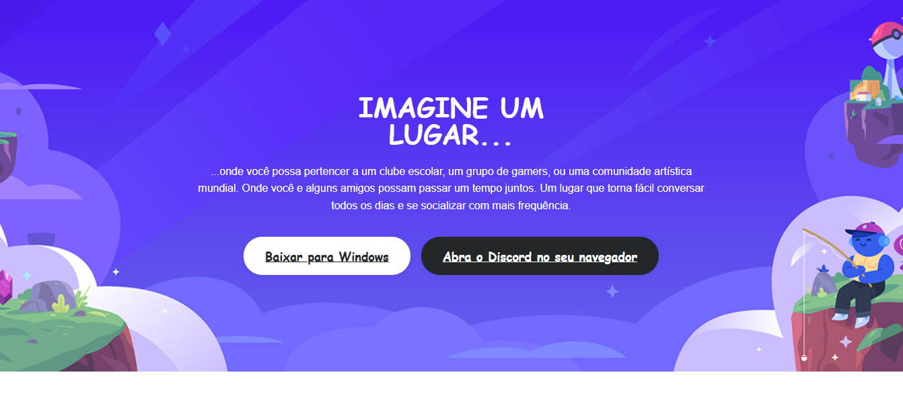

# 🎧 Discord Landing Page Clone

Clone da **Landing Page do Discord**, desenvolvido com **HTML5 e CSS3**, com foco em prática de **estruturação semântica, layout moderno e responsividade**.

Projeto criado como parte do meu aprendizado em **Desenvolvimento Front-end**, reproduzindo interfaces reais para fortalecer habilidades profissionais e construção de portfólio.

---

## 📸 Preview do Projeto



---

## 🚀 Tecnologias Utilizadas

* HTML5
* CSS3
* Flexbox
* Layout Responsivo
* Estrutura Semântica

---

## 🎯 Objetivo do Projeto

Este projeto foi desenvolvido com o objetivo de:

* Praticar HTML semântico
* Trabalhar com CSS moderno
* Reproduzir interfaces reais do mercado
* Melhorar organização de layout
* Fortificar portfólio front-end

---

## 📂 Estrutura do Projeto

```
landing-page-discord
│
├── index.html
├── README.md
│
└── assets
    │
    ├── css
    │   └── style.css
    │
    └── imag
        ├── hero-bg.png
        ├── logo.png
        ├── section-01.png
        ├── section-02.png
        ├── section-03.png
        └── section-04.png
```


## 💻 Como Executar o Projeto

Clone o repositório:

```
git clone https://github.com/Lorenconde/landing-page-discord.git
```


Abra o arquivo:

```
index.html
```

---

## 📱 Responsividade

O layout foi desenvolvido utilizando **Flexbox**, permitindo adaptação para:

* Desktop
* Tablet
* Mobile

---

## 📚 Aprendizados

Durante o desenvolvimento deste projeto pratiquei:

* Estruturação semântica HTML
* Organização de arquivos CSS
* Construção de layouts modernos
* Responsividade com Flexbox
* Reprodução fiel de interface real

---

## 🔗 Deploy do Projeto

Caso publicado via GitHub Pages:

```
https://lorenconde.github.io/landing-page-discord
```

---

## 👨‍💻 Autor

Desenvolvido por **Loren Conde**

GitHub:
https://github.com/Lorenconde

---

## ⭐ Contribuições

Sugestões e melhorias são sempre bem-vindas.

Se este projeto te ajudou ou serviu de inspiração, considere deixar uma ⭐ no repositório.

